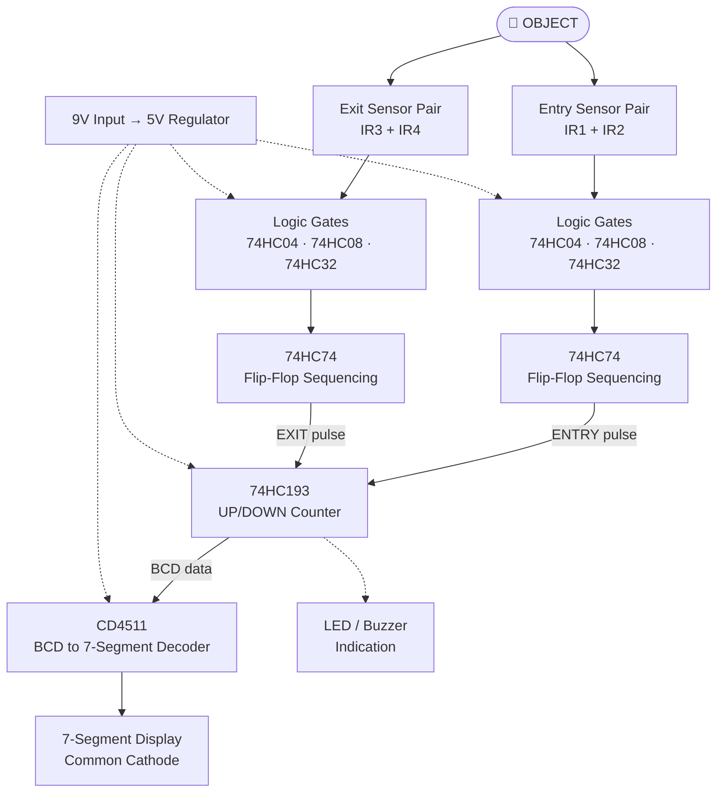

<div align="center">

# 🔍 IR-Based Object Detection and Counting Using Digital ICs

### A microcontroller-free entry/exit counter built with IR sensors, logic gates, a flip-flop, an up/down counter and a 7-segment display


<br>

<!-- ⬇️ Replace with your best prototype photo -->


<sub><i>Final breadboard prototype: IR sensors, logic ICs, counter and 7-segment display</i></sub>

</div>

## 📌 Project Overview

This project is a hardware-based **Object Detection and Counting System** designed entirely with digital electronics components.

The system detects objects passing through an **entry** or **exit** path using **IR sensor modules**. A **74HC193 up/down binary counter** counts them: the count goes **up** when an object enters and **down** when an object leaves.

The counter output is fed to a **CD4511 BCD-to-7-segment decoder**, which drives a **common-cathode 7-segment display** showing the current count.

> ⚡ **No Arduino, ESP32, ESP8266, Raspberry Pi or any other microcontroller is used.** Everything is done with standard logic ICs.

---

## 🎯 Project Objectives

- Detect objects using IR sensors.
- Detect entry and exit events separately.
- Count objects using digital logic.
- Increment the count when an object enters.
- Decrement the count when an object exits.
- Display the current count on a 7-segment display.
- Implement sensor sequencing using a flip-flop.
- Understand combinational and sequential digital logic.
- Build a practical electronics project without a microcontroller.

---

## ✨ Features

| Feature | Description |
|---|---|
| 🔹 Microcontroller-free | Pure hardware logic design |
| 🔹 Four IR sensor modules | Two for the entry path, two for the exit path |
| 🔹 Entry and exit detection | Direction is decided by sensor order |
| 🔹 Automatic up/down counting | 74HC193 synchronous counter |
| 🔹 7-segment numeric display | CD4511 decoder + common-cathode display |
| 🔹 LED status indicators | Visual feedback for sensors and events |
| 🔹 Buzzer indication | Audible beep on detection |
| 🔹 9V power input | Battery or adapter |
| 🔹 5V regulated logic supply | Stable supply for all ICs |
| 🔹 Breadboard implementation | Easy to build, modify and debug |
| 🔹 Low-cost design | Standard, easily available parts |

---

## 🧠 Working Principle

The system uses four IR sensors divided into two sections.

### 🚪 Entry Section

Two IR sensors (**IR1** and **IR2**) are placed at the entrance.

When an object passes through them **in the required sequence**, the logic circuit recognizes an **entry** and generates an **entry pulse**. This pulse goes to the **UP input** of the 74HC193, so the counter **increases by one**.

### 🚶 Exit Section

Two more IR sensors (**IR3** and **IR4**) are placed at the exit.

When an object passes through them **in the required sequence**, the circuit recognizes an **exit** and generates an **exit pulse**. This pulse goes to the **DOWN input** of the 74HC193, so the counter **decreases by one**.

### 🔢 Display Section

The 4-bit output of the counter goes to the **CD4511** decoder. The CD4511 converts the BCD count into the seven segment signals (a to g) needed by the common-cathode display, so the current count is shown as a digit.

### 🔁 Step-by-Step Operation

1. IR modules continuously emit infrared light and watch for its reflection.
2. An object interrupts or reflects the beam and the sensor output changes state.
3. The **inverter (74HC04)** conditions the sensor signals to the logic level the gates need.
4. The **AND (74HC08)** and **OR (74HC32)** gates combine the two sensor signals of a pair.
5. The **D flip-flop (74HC74)** remembers which sensor triggered first, so the order is checked and false triggers are rejected.
6. A clean pulse is produced on the entry or exit line.
7. The **74HC193** counts up or down on that pulse.
8. The **CD4511** decodes the count and the **7-segment display** shows it.

---

## 🔄 System Block Diagram

### Interactive diagram (renders on GitHub)



### Text diagram

```text
                         OBJECT
                           │
              ┌────────────┴────────────┐
              │                         │
              ▼                         ▼
       ENTRY SENSOR PAIR          EXIT SENSOR PAIR
        IR1 + IR2                  IR3 + IR4
              │                         │
              ▼                         ▼
       ┌──────────────┐          ┌──────────────┐
       │ Logic Gates  │          │ Logic Gates  │
       │ 74HC04       │          │ 74HC04       │
       │ 74HC08       │          │ 74HC08       │
       │ 74HC32       │          │ 74HC32       │
       └──────┬───────┘          └──────┬───────┘
              │                         │
              ▼                         ▼
       ┌──────────────┐          ┌──────────────┐
       │   74HC74     │          │   74HC74     │
       │ Flip-Flop    │          │ Sequencing   │
       └──────┬───────┘          └──────┬───────┘
              │                         │
              │       ENTRY / EXIT      │
              └──────────┬──────────────┘
                         │
                         ▼
                  ┌──────────────┐
                  │   74HC193    │
                  │ UP/DOWN      │
                  │   COUNTER    │
                  └──────┬───────┘
                         │
                         │ BCD DATA
                         ▼
                  ┌──────────────┐
                  │    CD4511    │
                  │ BCD DECODER  │
                  └──────┬───────┘
                         │
                         ▼
                  ┌──────────────┐
                  │  7-SEGMENT   │
                  │   DISPLAY    │
                  └──────────────┘
```

---

## 🧰 Components Used

| # | Component | Quantity | Purpose |
|---|---|:---:|---|
| 1 | IR sensor module | 4 | Detect objects at entry and exit |
| 2 | 74HC04 (hex inverter) | 1 | Signal inversion / conditioning |
| 3 | 74HC08 (quad 2-input AND) | 1 | Combine sensor conditions |
| 4 | 74HC32 (quad 2-input OR) | 1 | Combine sensor conditions |
| 5 | 74HC74 (dual D flip-flop) | 1–2 | Sequencing / direction memory |
| 6 | 74HC193 (4-bit up/down counter) | 1 | Counts entries and exits |
| 7 | CD4511 (BCD to 7-segment decoder) | 1 | Drives the display |
| 8 | Common-cathode 7-segment display | 1 | Shows the count |
| 9 | LEDs | As needed | Status indication |
| 10 | Buzzer | 1 | Audible indication |
| 11 | 5V voltage regulator (e.g. 7805) | 1 | Regulated logic supply |
| 12 | 9V battery or adapter | 1 | Power source |
| 13 | Resistors | As needed | Segment and LED current limiting, pull-ups |
| 14 | Capacitors | As needed | Supply decoupling |
| 15 | Breadboard and jumper wires | 1 set | Assembly |

> 📝 Edit quantities and exact part values to match your build. The resistor and capacitor values below are typical starting points.

### Suggested passive values

| Part | Typical Value | Use |
|---|---|---|
| Segment resistors (×7) | 330 Ω | Limit current per segment |
| LED resistors | 330 Ω – 470 Ω | Limit LED current |
| Pull-up resistors | 10 kΩ | Keep UP/DOWN idle HIGH |
| Decoupling capacitor | 0.1 µF (per IC) | Reduce supply noise |
| Regulator input/output caps | 10 µF – 100 µF | Stabilise 5V rail |

---

## 🔌 IC Details and Pin Connections

### 74HC193: Presettable 4-bit Up/Down Counter

| Pin | Name | Connection in this project |
|:---:|---|---|
| 16 | VCC | +5V |
| 8 | GND | GND |
| 5 | UP (CPU) | Entry pulse |
| 4 | DOWN (CPD) | Exit pulse |
| 14 | CLEAR (MR) | GND (HIGH = reset; connect to a push-button for manual reset) |
| 11 | LOAD (PL) | +5V (inactive; active LOW) |
| 15, 1, 10, 9 | A, B, C, D (preset data) | GND (unused) |
| 3 | QA (LSB) | CD4511 pin 7 (A) |
| 2 | QB | CD4511 pin 1 (B) |
| 6 | QC | CD4511 pin 2 (C) |
| 7 | QD (MSB) | CD4511 pin 6 (D) |
| 12 | CARRY | Unused (for cascading) |
| 13 | BORROW | Unused (for cascading) |

**Counting rule:** the counter counts **on the rising edge** of the UP input while DOWN is HIGH (count up), or on the rising edge of the DOWN input while UP is HIGH (count down). The idle level of the unused clock input must therefore be **HIGH**.

### CD4511: BCD to 7-Segment Latch/Decoder/Driver

| Pin | Name | Connection |
|:---:|---|---|
| 16 | VDD | +5V |
| 8 | VSS | GND |
| 7, 1, 2, 6 | A, B, C, D (BCD inputs) | From 74HC193 QA, QB, QC, QD |
| 3 | LT (lamp test) | +5V (active LOW; tie to GND briefly to test all segments) |
| 4 | BI (blanking) | +5V (active LOW; keeps display on) |
| 5 | LE (latch enable) | GND (transparent; display follows the count) |
| 13 | a | Segment a (via 330 Ω) |
| 12 | b | Segment b (via 330 Ω) |
| 11 | c | Segment c (via 330 Ω) |
| 10 | d | Segment d (via 330 Ω) |
| 9 | e | Segment e (via 330 Ω) |
| 15 | f | Segment f (via 330 Ω) |
| 14 | g | Segment g (via 330 Ω) |

The common-cathode pin(s) of the display go to **GND**.

### Counter → Decoder → Display Truth Table

| Count | QD | QC | QB | QA | Display |
|:---:|:---:|:---:|:---:|:---:|:---:|
| 0 | 0 | 0 | 0 | 0 | **0** |
| 1 | 0 | 0 | 0 | 1 | **1** |
| 2 | 0 | 0 | 1 | 0 | **2** |
| 3 | 0 | 0 | 1 | 1 | **3** |
| 4 | 0 | 1 | 0 | 0 | **4** |
| 5 | 0 | 1 | 0 | 1 | **5** |
| 6 | 0 | 1 | 1 | 0 | **6** |
| 7 | 0 | 1 | 1 | 1 | **7** |
| 8 | 1 | 0 | 0 | 0 | **8** |
| 9 | 1 | 0 | 0 | 1 | **9** |
| 10–15 | 1 | x | x | x | *Blank (invalid BCD)* |

### Logic ICs

| IC | Function | Role |
|---|---|---|
| 74HC04 | Hex inverter | Inverts IR module outputs / builds pulses |
| 74HC08 | Quad AND | Detects "both sensors in correct state" |
| 74HC32 | Quad OR | Merges conditions |
| 74HC74 | Dual D flip-flop | Stores which sensor fired first (sequencing) |

> ⚠️ **Unused gate inputs must never float.** Tie them to GND or +5V to avoid random switching and extra current draw.

---

## 🔋 Power Supply Design

```text
 9V Battery / Adapter ──►[ 7805 Regulator ]──► +5V rail
                              │  │
                           10µF  0.1µF
                              │  │
                             GND GND
```

- All logic ICs and IR modules run from the **same regulated +5V rail**.
- Place a **0.1 µF capacitor** close to the VCC pin of every IC.
- Keep a **common ground** between the regulator, ICs, sensors and display.
- Make sure the IR modules' supply range includes 5V (most modules work from 3.3V to 5V).

---

## 🧩 Sequence Detection Logic

The flip-flop remembers which sensor of a pair was triggered first, so a stray flicker or a half-pass does not produce a count.

| Event | Sensor order | Result |
|---|---|---|
| Object enters | IR1 → IR2 | Entry pulse → counter **+1** |
| Object exits | IR3 → IR4 | Exit pulse → counter **−1** |
| Partial pass (only first sensor) | IR1 only (or IR3 only) | Ignored, no count |
| Wrong order | IR2 → IR1 (or IR4 → IR3) | Ignored, no count |

> 📝 Add your own gate-level schematic in `schematics/` and describe the exact gate wiring here if you want this section to match your build precisely.

---

## 📐 Circuit Diagram and Schematic

<div align="center">

<!-- ⬇️ Replace with your schematic export (KiCad / Proteus / Tinkercad / hand-drawn scan) -->


<sub><i>Complete circuit diagram</i></sub>

</div>

Tools you can use to draw it: **Tinkercad Circuits**, **Proteus**, **KiCad**, **EasyEDA** or **Falstad Circuit Simulator**.

## 🛠️ Build Steps

1. **Set up power.** Wire the 9V source to the regulator and confirm a stable **5.0V** with a multimeter before connecting any IC.
2. **Mount the ICs** on the breadboard and connect VCC and GND on each one. Add 0.1 µF decoupling capacitors.
3. **Build the display stage first.** Connect the CD4511 to the 7-segment display with 330 Ω resistors. Tie LT and BI to +5V and LE to GND.
4. **Add the counter.** Wire the 74HC193 outputs to the CD4511 inputs. Tie LOAD to +5V, the preset inputs to GND, and CLEAR to a reset button (pulled to GND).
5. **Test the counter manually.** Pulse the UP pin with a push-button and confirm the display counts 0, 1, 2 … Then test DOWN.
6. **Add the logic gates and flip-flops** for the entry and exit sections.
7. **Connect the four IR sensors** and verify each sensor's output level with and without an object.
8. **Add the LED and buzzer indicators.**
9. **Align the sensors** so the entry pair and exit pair face the path correctly, then run full tests.

---

## ✅ Testing and Verification

| Test | Procedure | Expected result |
|---|---|---|
| Power check | Measure the +5V rail | 4.9 V – 5.1 V |
| Display test | Tie CD4511 LT to GND | All segments light up |
| Counter up | Pulse UP with a button | Display increments |
| Counter down | Pulse DOWN with a button | Display decrements |
| Reset | Press the reset button | Display shows 0 |
| Sensor test | Place an object in front of each IR module | Sensor LED toggles |
| Entry test | Pass an object IR1 → IR2 | Count +1 |
| Exit test | Pass an object IR3 → IR4 | Count −1 |
| False trigger test | Wave an object in front of one sensor only | No count change |

---

## 🧯 Troubleshooting

| Problem | Likely cause | Fix |
|---|---|---|
| Display shows random digits | Floating CD4511 inputs or loose wires | Recheck BCD wiring and ground |
| Counter jumps by 2 or more | Sensor bounce or noisy signal | Add a debounce / pulse-shaping stage, add decoupling caps |
| Counter won't count | UP/DOWN idle level LOW, or CLEAR/LOAD wrong | Keep idle HIGH, CLEAR LOW, LOAD HIGH |
| Segments are dim | Resistors too large or supply drooping | Use 330 Ω, check 5V rail |
| Sensor always triggered | Strong ambient IR or sensor too sensitive | Adjust the potentiometer on the module, shield from sunlight |
| Count doesn't change on entry | Wrong sensor order or alignment | Swap IR1/IR2 positions and re-test |
| ICs get warm | Floating inputs or wiring short | Tie unused inputs, check for shorts |

---

## 💡 Applications

- 🏫 Classroom, library or lab occupancy counting
- 🏬 Shops and malls (footfall counting)
- 🅿️ Parking entry/exit counting
- 🏭 Conveyor / production-line item counting
- 🏢 Room or building visitor counting
- 🔐 Entry/exit logging for restricted areas
- 🎓 Digital electronics teaching demonstration

---

## 👍 Advantages

- No programming required
- Fast, hardware-speed response
- Easy to understand and debug
- Low cost and uses common parts
- Great for learning counters, flip-flops and decoders

---

## ⚠️ Limitations

- **Single-digit display:** the CD4511 only decodes BCD values 0 to 9. With one display, counts 10 to 15 show blank, and counting down from 0 wraps to 15 (blank).
- Only one object can be tracked reliably at a time (simultaneous entry and exit may be missed).
- IR sensors are affected by strong sunlight and reflective surfaces.
- No data storage or remote monitoring.
- Breadboard connections can loosen, so a PCB is recommended for long-term use.

---

## 🚀 Future Improvements

- Add a **second CD4511 + display** and cascade a second counter (using CARRY/BORROW) for **two-digit counting (00–99)**.
- Add logic to **limit the count** between 0 and 9 so it never wraps.
- Add a **debounce / Schmitt-trigger stage** (e.g. 74HC14) on each sensor.
- Show a **room-full / room-empty indicator** with comparators.
- Add an **automatic light or fan control** relay based on occupancy.
- Design a **custom PCB** and a 3D-printed enclosure.
- Add wireless monitoring as an optional extension.

---

## 🎓 Learning Outcomes

- Working of IR proximity sensors
- Combinational logic with AND, OR and NOT gates
- Sequential logic with D flip-flops
- Synchronous up/down counters
- BCD encoding and 7-segment decoding
- Power supply design and decoupling
- Breadboard prototyping, testing and debugging

---

## 👨‍💻 Author

**Nandkishor**
ECE Student · Software Developer · Linux User

[](https://github.com/nandkishor22)

---

<div align="center">

⭐ If you found this project useful, consider starring the repository! ⭐

</div>
